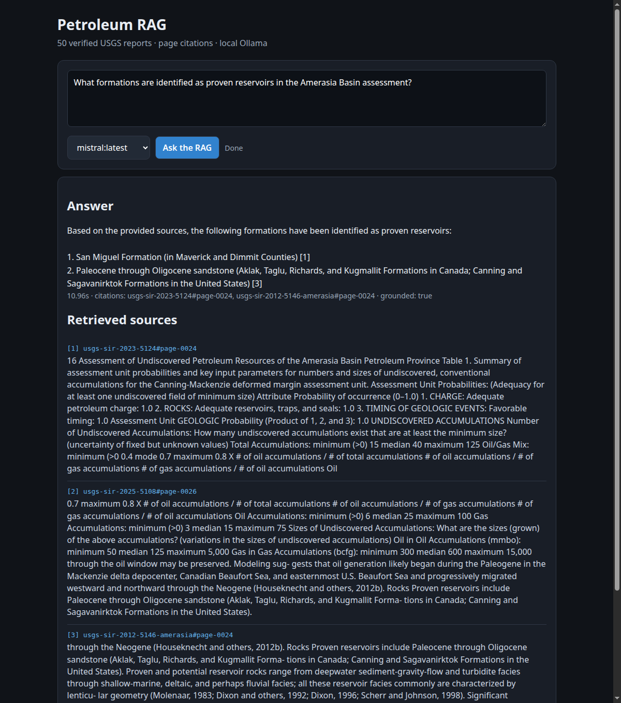

# Petroleum RAG v0.1 Quickstart

This is an educational, provenance-preserving RAG system over 50 public USGS petroleum reports.
It does not fine-tune an LLM. Reports are downloaded, split into page-aware chunks, indexed with
BM25 retrieval, and supplied to a local Ollama model at question time.



## Architecture

```text
USGS manifest + checksums
        |
        v
PDF pages -> clean chunks + table facts -> BM25 retriever
                                             |
Question -> query expansion -> top passages -> Ollama -> cited answer
```

## Install

```bash
git clone https://github.com/sergeiredkin/LLM-internals.git
cd LLM-internals
conda env create -f environment.yml
conda run -n gpu-test python check_environment.py
```

The raw PDFs are intentionally not committed to Git. The manifest contains the official URLs,
source metadata, licenses, and SHA-256 checksums. The build command downloads missing PDFs and
fails on checksum mismatch.

## Build and verify

```bash
make rag-build RAG_PYTHON="conda run -n gpu-test python"
make rag-check RAG_PYTHON="conda run -n gpu-test python"
make rag-test RAG_PYTHON="conda run -n gpu-test python"
```

The release corpus should contain 50 sources, page-aware chunks, table facts, 50 benchmark
questions, and 50 answer records. `make rag-check` verifies the release without invoking an LLM.

## Run the browser app

Make sure Ollama is running and has a model available:

```bash
ollama serve
ollama pull mistral:latest
```

Start the UI:

```bash
make rag-web RAG_PYTHON="conda run -n gpu-test python"
```

Open <http://localhost:7860>. The interface shows the answer, citations, retrieved report pages,
latency, and a grounding status. `mistral:latest` is the fast default on an RTX 3060; Qwen can be
selected for a slower second opinion.

## Command-line evaluation

```bash
make rag-benchmark RAG_PYTHON="conda run -n gpu-test python"
make rag-ollama RAG_PYTHON="conda run -n gpu-test python" RAG_MODEL=mistral:latest
```

The retrieval benchmark measures whether the right evidence is found. The Ollama report measures
citation and abstention behavior. These are different tests: a cited answer can still require
human review for factual completeness.

## Adding reports later

Add a new manifest record only when the source has a clear official URL, license/provenance, and
SHA-256 checksum. Then rebuild and test:

```bash
conda run -n gpu-test python -m scripts.run_petroleum_expansion \
  --batch 5 --accept-regression --commit
```

For production-style updates, the desired lifecycle is:

```text
new report -> checksum/license gate -> ingest -> rebuild index -> regression tests -> publish version
```

## Reproducibility notes

- Retrieval is deterministic for a fixed corpus, configuration, and dependency set.
- LLM wording is not guaranteed to be byte-identical across models, Ollama versions, or hardware.
- Strict RAG mode asks the LLM to use only retrieved evidence and cite report pages.
- If the reports do not support an answer, the system should abstain rather than invent one.
- The current corpus is an educational domain collection, not a substitute for independent
  petroleum engineering or investment analysis.

## Current release evidence

The repository includes the final 50-source corpus manifest, expansion reports, the 50-question
benchmark, the browser interface, and the final Ollama validation report. Retrieval quality and
answer quality are tracked separately so future ranking improvements can be measured without
silently changing the corpus.
